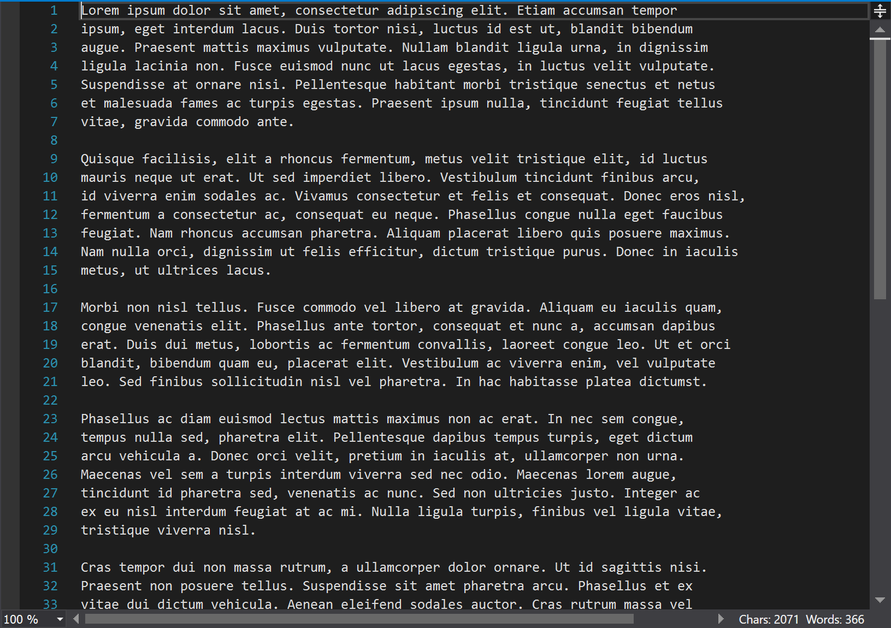

# WordCount

Simple extension for Microsoft Visula Studio to show character, word and line count.

# Changelog

* **0.5.0** (07 January 2023)
  Support for Visual Studio 2022.

* **0.4.0** (16 January 2021)
  * Display line count. Suggested by Roman Thiel.

* **0.3.1** (16 January 2020)
  * Fixed: Word count margin is displayed for non-document editors. Thanks to Lars-Erik Aabech.

* **0.3.0** (8 January 2020)
  * Display word and char count of selection if any.

* **0.2.6** (18 December 2019)
  * Perform calculations asynchronously.

* **0.1.0** (13 December 2019)
  * Initial release.
